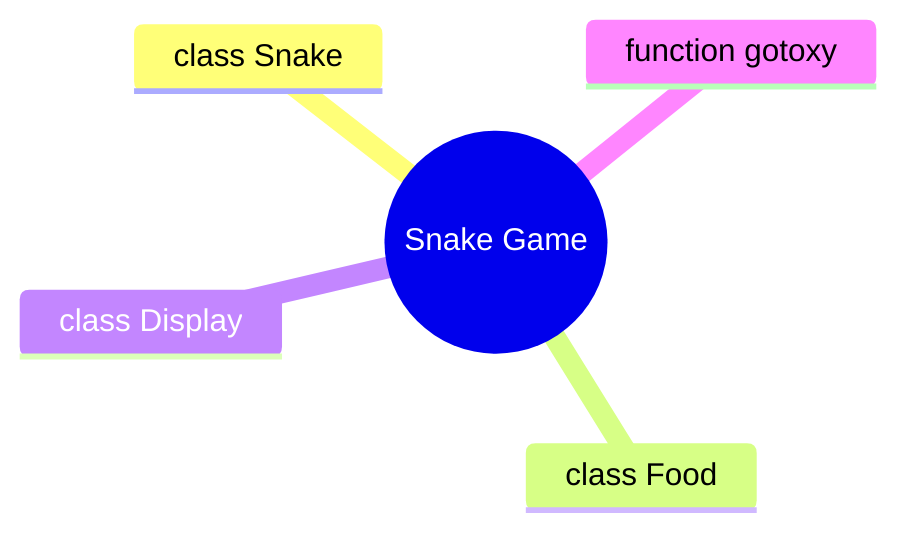

# 概況

- C++實作貪吃蛇遊戲
- OOP程式設計應用

# 規劃



# 01 顯示類
```cpp = 1
class Display
{
    friend Snake;

public:
    static void DrawMapInfo();
    static void DrawScore(int score);
    static void DrawSpeed(int speedLevel);
    static void RefreshMap();
    static void DrawStatus(int i);
}
```
- DrawMapInfo()
    - 顯示遊戲畫面的範圍
    - 顯示遊戲控制操作、其他資訊
- DrawScore(int score)
    - 顯示目前分數
    - 顯示歷史最高分
- DrawSpeed(int speedLevel)
    - 顯示貪吃蛇目前速度
- DrawStatus(int i)
    - 顯示遊戲狀態: start, restart, game over

# 02 貪吃蛇類
```cpp
class Snake
{
    friend class Food;

private:
    deque<COORD> m_body;    // snake body location
    COORD m_direction;      // direction of snake
    int m_score;            // current score
    int m_speed;            // current speed rate (millisecond per step)
    int m_speedLevel;       // speed level

public:
    Snake();
    int getSpeed();
    void SnakeCtrl(char key);
    void SnakeMove(Food& food);
    bool isEatFood(Food& food);
    bool isCollision();
}
```
- 2.1 SnakeCtrl(char key)
    - 傳入鍵盤輸入的字符來改變貪吃蛇的方向
    - 貪吃蛇**無法掉頭**，相反方向輸入屬於無效輸入
- 2.2 SnakeMove(Food& food)
    - 傳入Food物件，獲取Food物件實例的座標
    - 貪吃蛇移動**只改變頭部跟尾部位置**：首先新增頭部位置，判斷如果貪吃蛇沒有吃到食物，則刪除尾部位置
    - 新增的頭部位置為目前的**頭部位置加上行進方向的向量**
- 2.3 isEatFood(Food& food)
    - 傳入Food物件，獲取Food物件實例的座標，判斷貪吃蛇是否吃到食物
    - 吃到食物後加分
    - 吃到食物時，呼叫Food成員函數isEaten()
    - 吃到食物後加快貪吃蛇速度
- 2.4 isCollision()
    - 判斷新增的貪吃蛇頭部是否撞牆
    - 判斷新增的貪吃蛇頭部是否撞到自己

# 03 食物類
```cpp
class Food
{
    friend class Snake;
    
private:
    COORD m_location;   // food location
    
public:
    Food(Snake snake);
    void isEaten(Snake snake)
```
- 3.1 isEaten(Snake snake)
    - 當返回值為真，表示食物已經被吃掉，會在隨機位置生成一個新的食物
    - 食物位置不可以超出遊戲範圍，且食物不可以生成在貪吃蛇身上
    - 當Snake的成員函數isEatFood()判斷貪吃蛇吃到食物時，會呼叫Food::isEaten()

# 04 gotoxy()函數
- 將游標移動到Console的(x, y)位置
```cpp
void gotoxy(short x, short y)
{
    COORD coord;
    coord.X = x;
    coord.Y = y;
    SetConsoleCursorPosition(GetStdHandle(STD_OUTPUT_HANDLE), coord);
}
```

# 05 Main()函數

